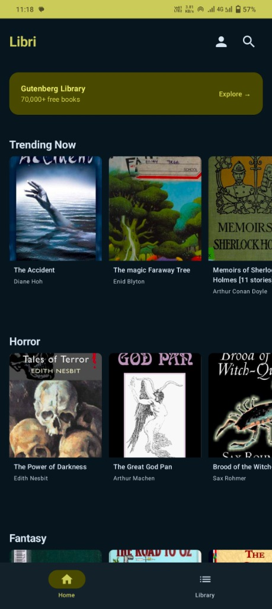
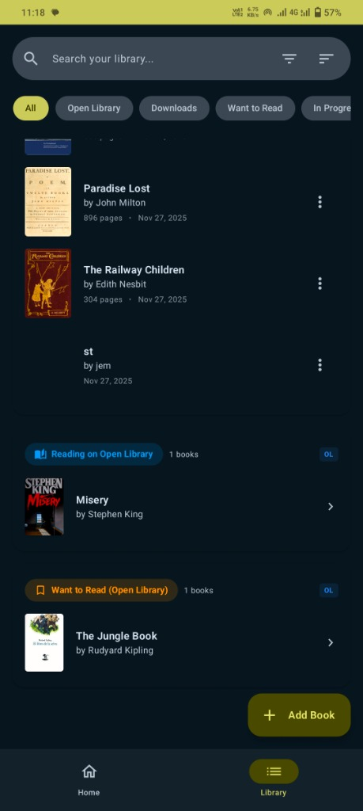
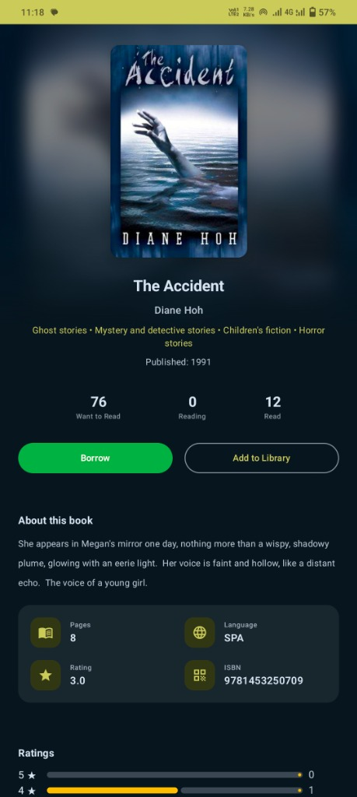
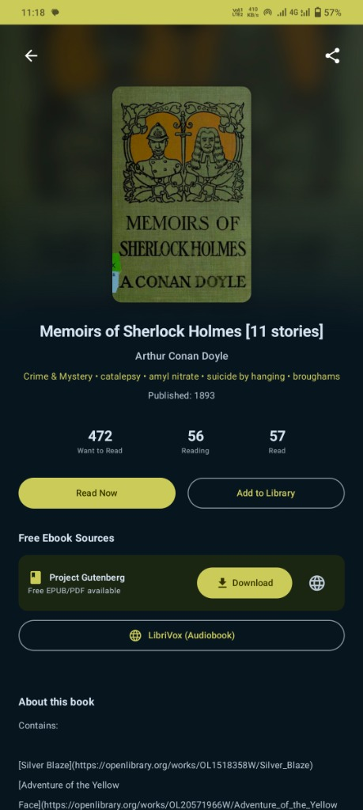

# 📚 Libri

> A modern, feature-rich ebook reader for Android

Libri is an elegant Android application built with **Kotlin** and **Jetpack Compose** that enables users to discover, read, and manage their digital book collection. With access to over **70,000+ free ebooks** from Project Gutenberg and seamless integration with Open Library, Libri brings the world of literature to your fingertips.

---

## ✨ Features

### 📖 Reading Experience
- **EPUB Reader** – Full-featured reader with chapter navigation, dark mode, and customizable font sizes
- **PDF Reader** – Built-in PDF viewer for document reading
- **Reading Progress** – Automatic progress tracking and bookmarks
- **Offline Reading** – Download books for offline access

### 📚 Book Discovery
- **Project Gutenberg Integration** – Access 70,000+ free public domain ebooks
- **Open Library API** – Search millions of books with detailed information
- **Advanced Search** – Filter books by author, subject, language, and more
- **Trending & Popular** – Discover popular books across various genres

### 📱 Library Management
- **Personal Library** – Organize your books with custom shelves
- **Reading Status** – Track books as "Want to Read", "Currently Reading", or "Finished"
- **Cloud Sync** – Sync your library across devices with Firebase
- **Book Details** – View cover images, descriptions, ratings, and edition information

### 🔐 Authentication
- **Google Sign-In** – Quick authentication with your Google account
- **Open Library Login** – Connect to borrow books from Internet Archive
- **Firebase Authentication** – Secure user management

### 🎨 User Experience
- **Material Design 3** – Modern, beautiful UI with Material You theming
- **Dark Mode** – Comfortable reading in any lighting condition
- **Smooth Animations** – Polished transitions throughout the app
- **Splash Screen** – Native Android 12+ splash screen support

---

## 🛠️ Tech Stack

| Category | Technology |
|----------|------------|
| **Language** | Kotlin |
| **UI Framework** | Jetpack Compose |
| **Architecture** | MVVM (ViewModel) |
| **Networking** | Retrofit + OkHttp |
| **Image Loading** | Coil |
| **Navigation** | Navigation Compose |
| **Authentication** | Firebase Auth + Google Sign-In |
| **Database** | Firebase Realtime Database |
| **Async** | Kotlin Coroutines |

---

## 📱 Screenshots

<p align="center">
  
  
  
  
</p>

| Home | Library | Book Details | Gutenberg |
|:----:|:-------:|:------------:|:---------:|
| Browse trending books | Manage your collection | View book info & borrow | Free ebooks from Project Gutenberg |

---

## 🚀 Getting Started

### Prerequisites
- Android Studio Hedgehog or newer
- JDK 11 or higher
- Android SDK 24+ (Android 7.0)

### Installation

1. **Clone the repository**
   ```bash
   git clone https://github.com/theblankstate/libri.git
   cd libri
   ```

2. **Set up Firebase**
   - Create a Firebase project at [Firebase Console](https://console.firebase.google.com/)
   - Enable Authentication (Google Sign-In)
   - Enable Realtime Database
   - Download `google-services.json` and place it in the `app/` directory

3. **Build and Run**
   ```bash
   ./gradlew assembleDebug
   ```

---

## 📁 Project Structure

```
app/
├── src/main/java/com/theblankstate/libri/
│   ├── data/              # Repositories and data sources
│   ├── data_retrieval/    # API services
│   ├── datamodel/         # Data models and entities
│   ├── ui/                # Theme and navigation
│   ├── view/              # Composable screens
│   │   ├── components/    # Reusable UI components
│   │   └── *.kt           # Feature screens
│   └── viewModel/         # ViewModels for each feature
```

---

## 🌐 API Integrations

### Open Library API
- Book search and metadata
- Cover images
- Edition information
- User reading lists

### Gutendex API
- Project Gutenberg catalog
- Free ebook downloads (EPUB, PDF)
- Book metadata and cover images

---

## 🔒 Permissions

| Permission | Purpose |
|------------|---------|
| `INTERNET` | Fetch book data and download ebooks |
| `POST_NOTIFICATIONS` | Download completion notifications |

---

## 📄 License

```
Copyright 2025 harryom

Licensed under the Apache License, Version 2.0 (the "License");
you may not use this file except in compliance with the License.
You may obtain a copy of the License at

    http://www.apache.org/licenses/LICENSE-2.0

Unless required by applicable law or agreed to in writing, software
distributed under the License is distributed on an "AS IS" BASIS,
WITHOUT WARRANTIES OR CONDITIONS OF ANY KIND, either express or implied.
See the License for the specific language governing permissions and
limitations under the License.
```

---

## 🤝 Contributing

Contributions are welcome! Please feel free to submit a Pull Request.

1. Fork the repository
2. Create your feature branch (`git checkout -b feature/AmazingFeature`)
3. Commit your changes (`git commit -m 'Add some AmazingFeature'`)
4. Push to the branch (`git push origin feature/AmazingFeature`)
5. Open a Pull Request

---

## 📧 Contact

**harryom** – [theblankstate.com](https://theblankstate.com)

---

## 🙏 Acknowledgments

- [Project Gutenberg](https://www.gutenberg.org/) for providing free access to public domain books
- [Open Library](https://openlibrary.org/) for their comprehensive book database
- [Gutendex](https://gutendex.com/) for the Gutenberg API
